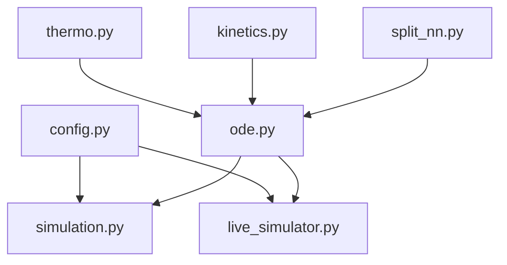

# Repo-map

Where code and docs live. Canonical agent map: [`AGENTS.md`](../../AGENTS.md).

## Package `bdsim/`

| Module | Role |
|--------|------|
| `__init__.py` | Public API: `run`, `run_with`, `LiveSimulator`, config types |
| `config.py` | `Parameters`, `Settings`, `ProcessFaults`, sensor/valve faults, PID, Results |
| `thermo.py` | Mixture / filter thermo leaves (`Qoil`, `Vmolar`, …) |
| `kinetics.py` | Transesterification rates (`rxrates`) |
| `split_nn.py` | Decanter split MLP + numpy `split()` |
| `ode.py` | `ODEmodel` / `AEmodel` — Numba RHS |
| `spectra.py` | Layer 2.8 NIR/IR virtual spectrum |
| `simulation.py` | Batch driver |
| `live_simulator.py` | Stateful per-step driver |
| `fouling_modes.py` | Layer 2.8b five-mode fouling stepper |
| `plots.py` / `cli.py` | Plotly + CSV; `python -m bdsim` |

## Tests / docs

| Path | Role |
|------|------|
| `tests/` | Smoke, fingerprints, Layer tests |
| `docs/` | **This vault** + optional upstream PDFs (may be gitignored) |
| `USER.md` / `ADMIN.md` / `NOTES.md` | Operator, install, historical fixes |

Related: [[Home]], [[What-is-bdsim]], [[ODE-and-AE]], [[Batch-driver]], [[Live-simulator]]
