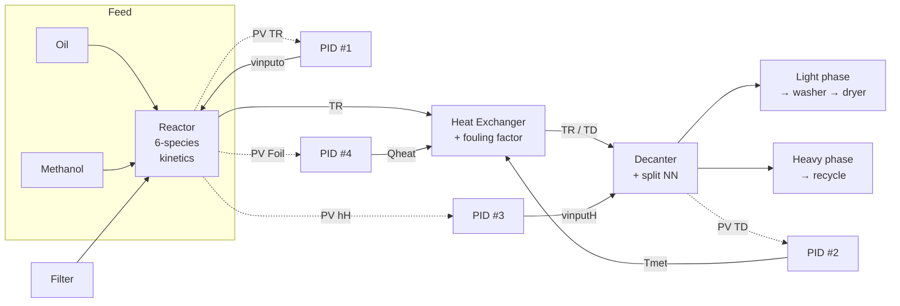
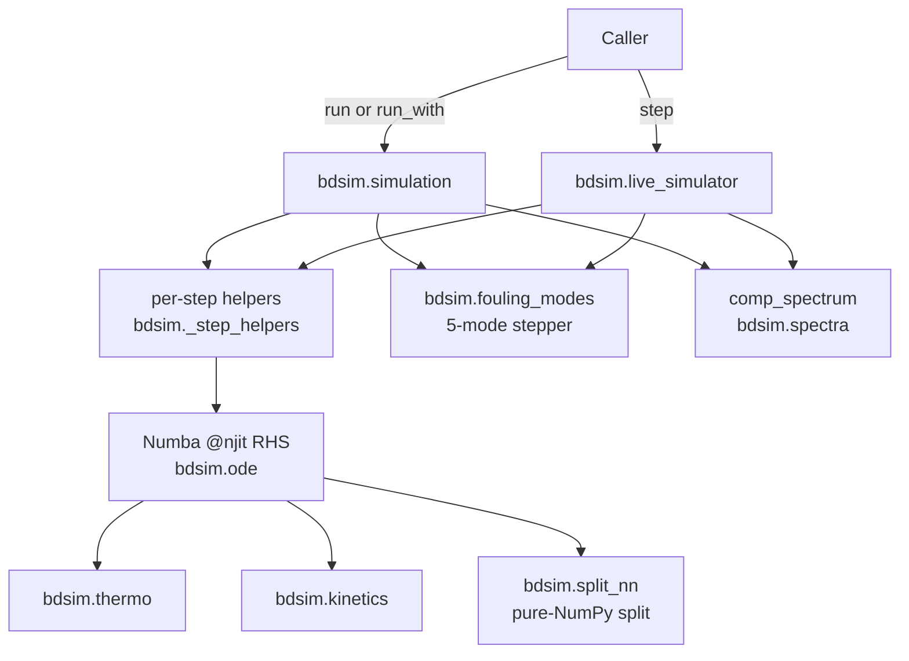

# What-is-bdsim

**bdsim** is a Python port of Natércia C. P. Fernandes’ **BDSIM** (University of Coimbra, 2019): a closed-loop **biodiesel plant** simulator.

It models: **filter → reactor → heat exchanger → decanter → washer → dryer**, with sensors, [PID](../Acronyms.md#pid) loops, valve [stiction](../Glossary.md#valve-stiction), and a decanter [split neural network](../20-math/Decanter-split-NN.md).

## Plant flow

## Code flow

## What this repo is

- The **simulation engine** (math / plant dynamics)
- A **multi-source data generator**: process vectors, setpoints, optional quality latches, disturbances, NIR/IR spectra, wear/fouling

## What this repo is not

- Not the operator UI, MQTT bridge, or scenario catalog → those live in **bdsim-dashboard**
- Not where fusion / ML training pipelines are implemented → *simulate sources here; fuse elsewhere*
- Not a place to “improve” plant physics without an agreed change and [fingerprint](../Glossary.md#fingerprint) update

## Who uses it

1. **bdsim-dashboard** — `LiveSimulator` step-by-step
2. **Fault-detection / ML research** — batch `run` / `run_with` with fixed seeds
3. **Data-fusion consumers** — time-aligned streams from one plant run

Shared contract: same seed + same `ProcessFaults` → [byte-identical trajectory](../00-orientation/Byte-identical-contract.md).

> [!note]
> Root [`AGENTS.md`](../AGENTS.md) is the hard rule sheet for agents. This vault is the junior-friendly deep dive.

Related: [Home](../Home.md), [Repo-map](../00-orientation/Repo-map.md), [Process-flow](../10-plant/Process-flow.md), [Glossary](../Glossary.md)
