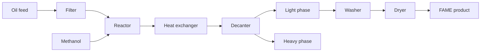

# Process-flow

Closed-loop biodiesel process modeled by bdsim (upstream BDSIM).

## Units and code touchpoints

| Unit | What happens | Primary code |
|------|----------------|--------------|
| Filter | Pore radius / clogging; oil flow `Qoil` | [Thermo](../20-math/Thermo.md), `sv[18]`, `pv[3]`/`pv[4]` |
| Reactor | Transesterification + energy balance | [Kinetics](../20-math/Kinetics.md), [ODE-and-AE](../20-math/ODE-and-AE.md), `sv[0:7]` |
| HEX | Cooling duty `Qheat`, [fouling factor](../Glossary.md#fouling--fouling-factor) | [Config-surface](../30-engine/Config-surface.md), `u[4]` |
| Decanter | Phase split via [Decanter-split-NN](../20-math/Decanter-split-NN.md); levels / T | `sv[7:18]`, `split()` |
| Washer / dryer | Post-process light phase → `xLend` / `yLend` | drivers + AE path |

## Control loops (sketch)

Four PID loops (see [Sensors-and-control](../10-plant/Sensors-and-control.md)): reactor T, decanter T, heavy interface level, oil flow. Controllers write into `uv`; plant responds through the ODE.

Related: [Units-and-streams](../10-plant/Units-and-streams.md), [Sensors-and-control](../10-plant/Sensors-and-control.md), [Home](../Home.md), [What-is-bdsim](../00-orientation/What-is-bdsim.md)
