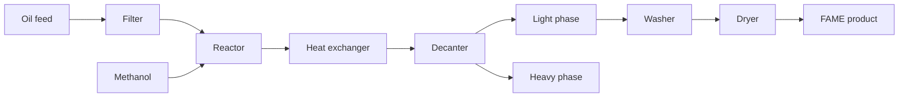

# Process-flow

Closed-loop biodiesel process modeled by bdsim (upstream BDSIM).

## Units and code touchpoints

| Unit | What happens | Primary code |
|------|----------------|--------------|
| Filter | Pore radius / clogging; oil flow `Qoil` | [[Thermo]], `sv[18]`, `pv[3]`/`pv[4]` |
| Reactor | Transesterification + energy balance | [[Kinetics]], [[ODE-and-AE]], `sv[0:7]` |
| HEX | Cooling duty `Qheat`, [[Glossary#Fouling / fouling factor\|fouling factor]] | [[Layers-roadmap]], `u[4]` |
| Decanter | Phase split via [[Decanter-split-NN]]; levels / T | `sv[7:18]`, `split()` |
| Washer / dryer | Post-process light phase → `xLend` / `yLend` | drivers + AE path |

## Control loops (sketch)

Four PID loops (see [[Sensors-and-control]]): reactor T, decanter T, heavy interface level, oil flow. Controllers write into `uv`; plant responds through the ODE.

Related: [[Units-and-streams]], [[Sensors-and-control]], [[Home]], [[What-is-bdsim]]
