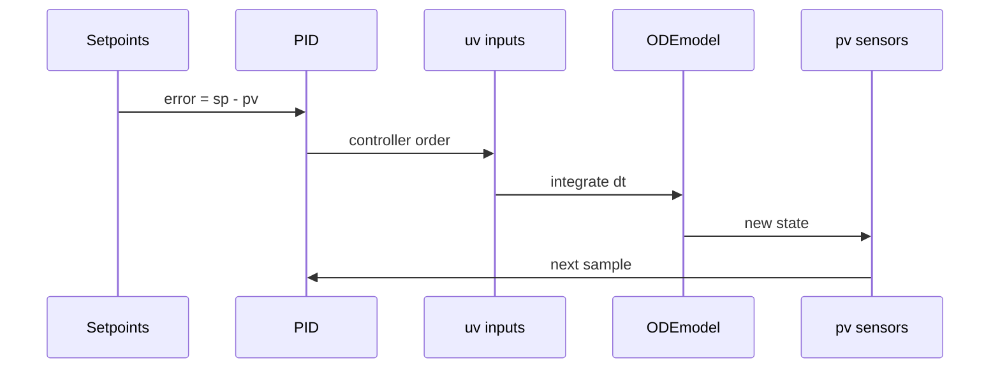

# Sensors-and-control

## Five process measurements (`pv`)

Computed in `_measurements` (`bdsim/simulation.py`):

| Index | Tag (informal) | Source | Unit (SI in engine) |
|-------|----------------|--------|---------------------|
| 0 | TR-101 | `sv[6]` reactor T | K |
| 1 | TD-201 | `sv[17]` decanter T | K |
| 2 | hH | `sv[16]` heavy interface | m |
| 3 | FICA-401 / Foil | `Qoil * ρ_oil` | kg/s |
| 4 | Filter DP | `K4F * Qo / r^4` | Pa (process ΔP) |

Fault model (batch): `pv = signal * (a * v + b + noise)`. Live adds bias / stuck / dropouts on `SensorFaults`. See [[Channel-indices]].

## PID loops

`Settings` wires modes and 1-based indices (converted to 0-based at build). Default setpoints:

| Loop | SP field | Typical PV |
|------|----------|------------|
| 1 | `sp1` / `live_sp1` | TR |
| 2 | `sp2` / `live_sp2` | TD |
| 3 | `sp3` / `live_sp3` | hH |
| 4 | `sp4` / `live_sp4` | Foil |

Controllers update every `nic` steps. Gains in `PIDController`. Valve path can apply [[Glossary#Valve stiction|stiction]] (`ValveFaults`).

Related: [[Process-flow]], [[Batch-driver]], [[Live-simulator]], [[Config-surface]]
