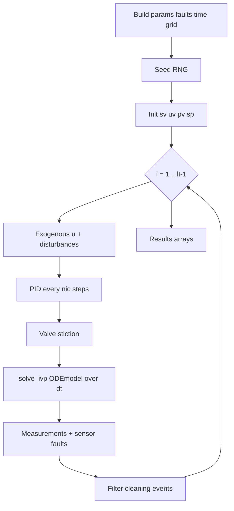

# Batch-driver

Module: `bdsim/simulation.py`. Entry points: `run()`, `run_with(...)`.

## Role

Integrate the full horizon offline and return a [[Config-surface|Results]] object (`t`, `sv`, `pv`, `uv`, `sp`, optional `quality`, `disturbances`, `factor`, …). Used for ML experiments and fingerprint pins.

## High-level loop



## Pseudocode

```text
run_with(settings, pfaults, sfaults, vfaults, seed, …):
  t = arange(ti, tf, dt)
  bind pfaults into settings for disturbances(t)
  allocate sv, uv, pv, sp
  for i in 1 .. len(t)-1:
      update exogenous / ARMAX / Layer tracks
      if i % nic == 0: PID → uv
      apply valve stiction
      integrate ODE from t[i-1] to t[i]
      resolve fouling factor (α / mode / static)
      pv[i] = measurements(sv[i], uv[i], faults)
  return Results(...)  # drop final unused row as upstream
```

## Public usage

```python
from bdsim import run_with
from bdsim.config import ProcessFaults
res = run_with(pfaults=ProcessFaults(fouling_dynamic=False), seed=42)
```

See [`USER.md`](../../USER.md) for recipes. Contract: [[Byte-identical-contract]].

Related: [[Live-simulator]], [[ODE-and-AE]], [[Fingerprints-and-tests]], [[Sensors-and-control]]
