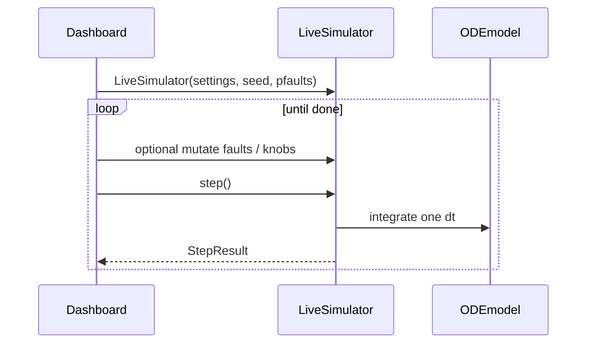

# Live-simulator

Module: `bdsim/live_simulator.py`. Class: `LiveSimulator`. Per-step payload: `StepResult`.

## Role

Stateful driver for **bdsim-dashboard**: one `step()` advances one `dt`, returns sensors/state for MQTT/HTTP. Same plant math as [[Batch-driver]] when knobs match; live path has its own fingerprint pins.

## Lifecycle



## Pseudocode

```text
sim = LiveSimulator(settings, seed, pfaults, …)
while not sim.done:
    # mid-run: sim.sensor_faults.bias[i] = …
    #          sim.set_*_knob(...); fouling windows; CW trip helpers
    s = sim.step()   # StepResult: t, pv, uv, sv, sp, quality, …
```

## Live-only capabilities

- Mutate `sensor_faults` between steps (bias / stuck / dropouts)
- Layer 2.6b CW pump trip / disturbance overlays
- Layer 2.7 operator knobs (`live_*` fields on `ProcessFaults`)
- Layer 2.8 spectra attached on fire times (`StepResult.spectra`)
- `activate_fouling_mode_window` for Layer 2.8b

> [!tip]
> Prefer first-class methods over private `_` attributes when extending the live API. See [`USER.md`](../../USER.md) for current patterns.

Related: [[Batch-driver]], [[Config-surface]], [[Sensors-and-control]], [[Layers-roadmap]]
